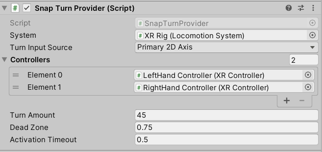

## 环境配置
下载sdk，和调试sdk(里面有previewtool的apk安装在pico上并运行，pico上要打开开发者模式，然后PC上也要打开preview tool)这样就可以在Unity上实时运行vr程序，Unity里面需要设置pico应用的appid，设置环境为pico环境，build Setting也要选择pico，安卓sdk选择android 8(api 26)
pico的sdk里面有一个json文件，unity打开package manager选择从磁盘加载，选择json文件即可

## 组件备注
#### 头盔运行
直接在场景中拖放一个Room-Scale XR Rig就是头盔组件

#### 传送
1.XR Rig上添加Teleportation Provider组件和Locomotion System组件，并且将后者赋值给前者的System变量
2.在Terrain上添加Teleportation Area组件，并且在Teleportation Provider变量上添加上XR Rig(Teleportation Provider)

#### 转方向
在XR Rig上添加上Snap Turn Provider组件，设置一下System变量(XR Rig的Locomotion System组件)，并且设置Controllers的左右操作手柄组件RightHandController，这样就可以手柄上的遥感操作


## 参考教程
https://www.bilibili.com/video/BV1Gu411y7i3/?spm_id_from=333.788&vd_source=02685a8a05689ff22758c5389478b63d